# Initial Setup
## Fork from the ENSF-400-PROJECT Master Branch
This is because we need to change the repository 's settings, which requires you to have "Admin" level privileges, which is only available to the owner of the repository . Unless the it is owned by an organization.

## Start Jenkins instance as seen in Lab 9
1. Enter the terminal with the command: Control + Shift + `
2. Go to the Jenkins Folder with the command  ```cd jenkins/```
3. Run this command:
```bash
$ docker compose up -d
```
4.  Go to the "Ports" section:
<p align='center'>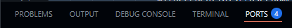</img></p>
5.  Make the Jenkins Port visible (set as 8080)
<p align='center'>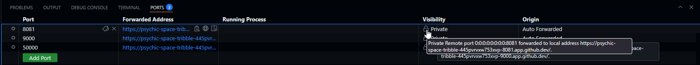</img></p>
<p align='center'>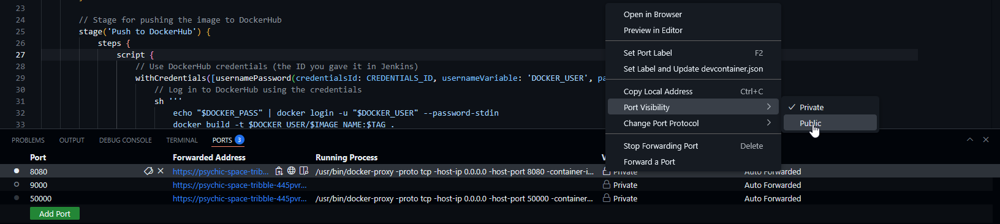</img></p>

Should look like this now:

<p align='center'>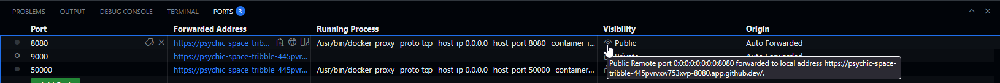</img></p>

6. Go back to your Terminal then run this command to find your key to unlock Jenkins:
```bash
$ docker compose logs jenkins
```

Then in the output you should find the key (highlighted, unique per user): 
<p align='center'>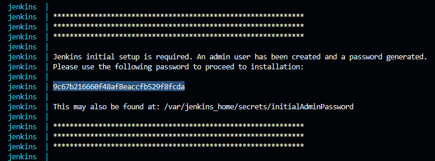</img></p>

7. Click the globe icon to visit your Jenkins GUI:
<p align='center'>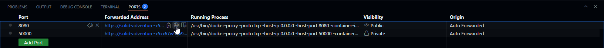</img></p>

8. Paste the password into the administrator password field and then click Enter:
<p align='center'>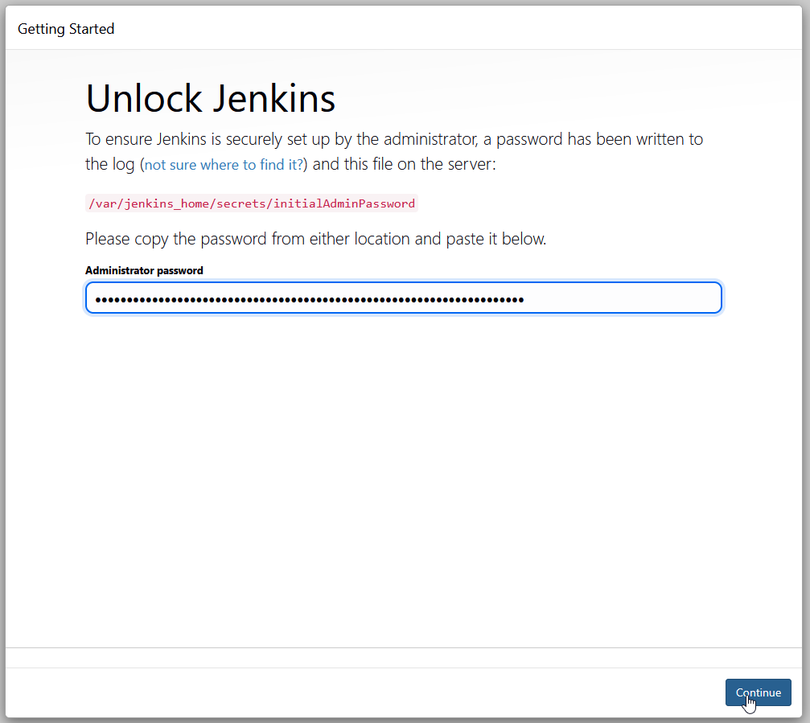</img></p>

9. Click Install Suggested Plugins
<p align='center'>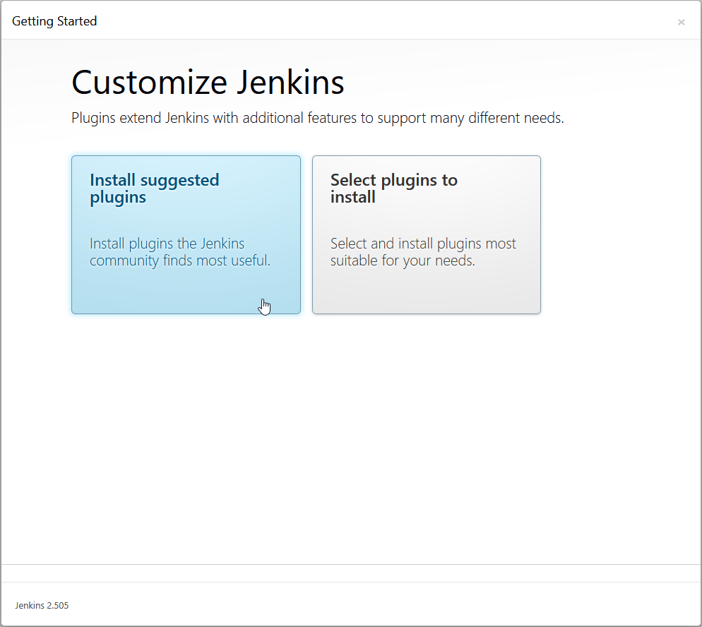</img></p>

10. "Create First Admin User" Page -> Fill in your desired credentials -> `Save and Continue` -> save your Jenkins URL (we need this later) -> `Save and Finish` -> `Start using Jenkins`
<p align="center">
<table border="0">
  <tr>
    <td>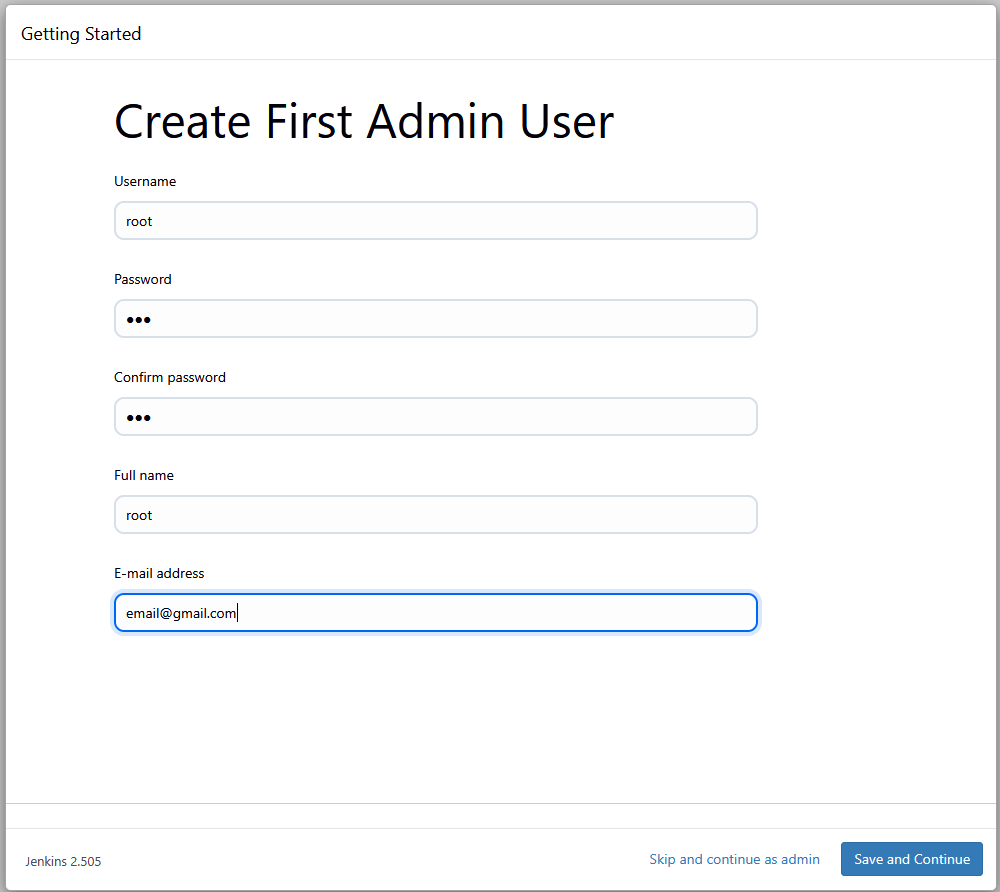</td>
    <td style="font-size: 40px; text-align: center;">→</td>
    <td>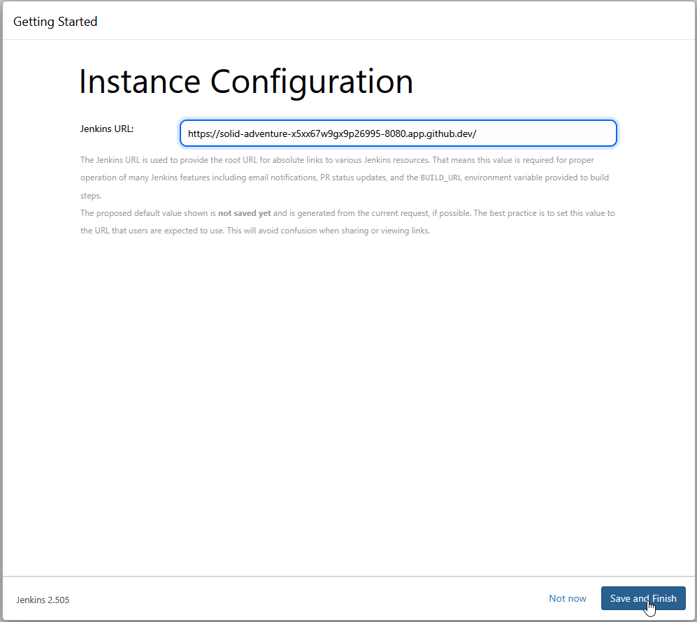</td>
    <td style="font-size: 40px; text-align: center;">→</td>
    <td>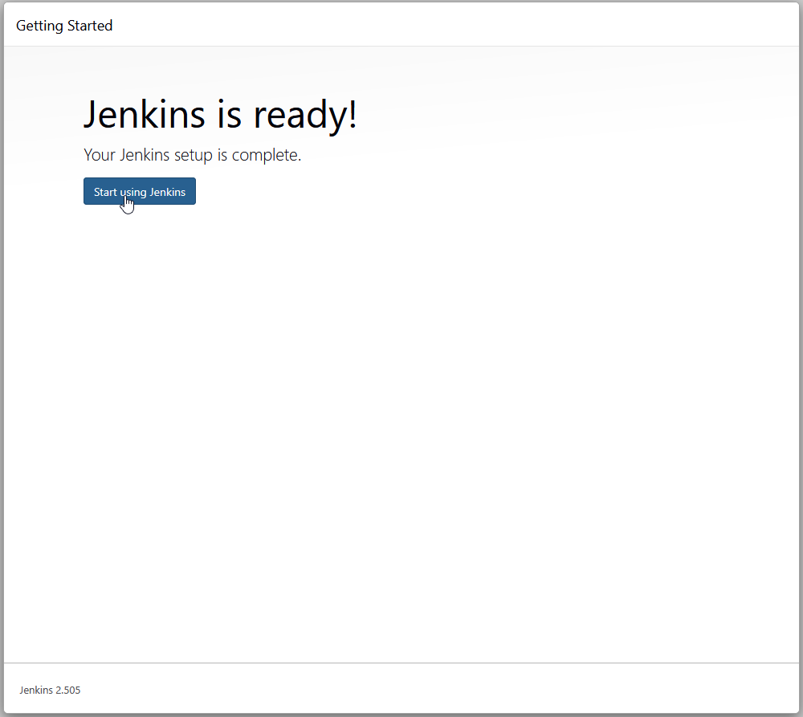</td>
  </tr>
</table>
</p>


11. Docker Pipeline Installation .. Dashboard -> Manage Jenkins -> Plugins -> Available Plugins -> Docker Pipeline    

<p align="center">
<table border="0">
  <tr>
    <td>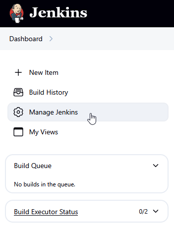</td>
    <td style="font-size: 40px; text-align: center;">→</td>
    <td>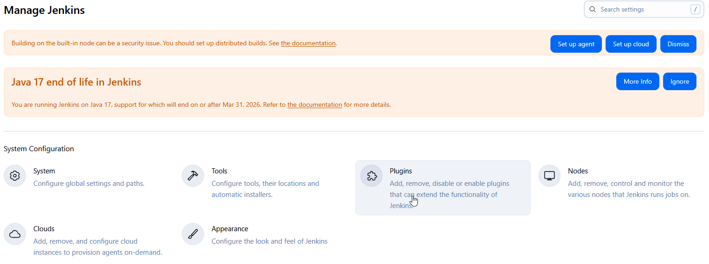</td>
    <td style="font-size: 40px; text-align: center;">→</td>
  </tr>
</table>
</p>

<p align='center'>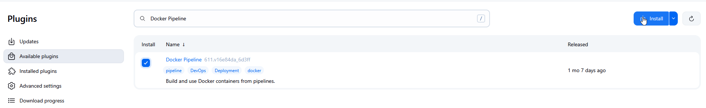</img></p>

12. Restart Jenkins after installing the plugin. Go back to your terminal and run this command:
```bash
$ docker compose restart jenkins
```

13. Refresh Jenkins page and re-login with credentials (the username and password you registered with)

14. Dashboard -> `New Item` -> Choose Job name -> `Pipeline` -> `OK`

<p align="center">
<table border="0">
  <tr>
    <td>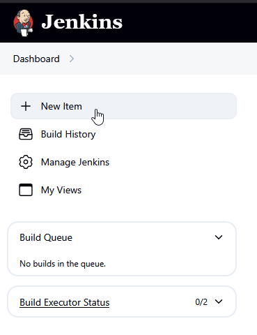</td>
    <td style="font-size: 40px; text-align: center;">→</td>
    <td>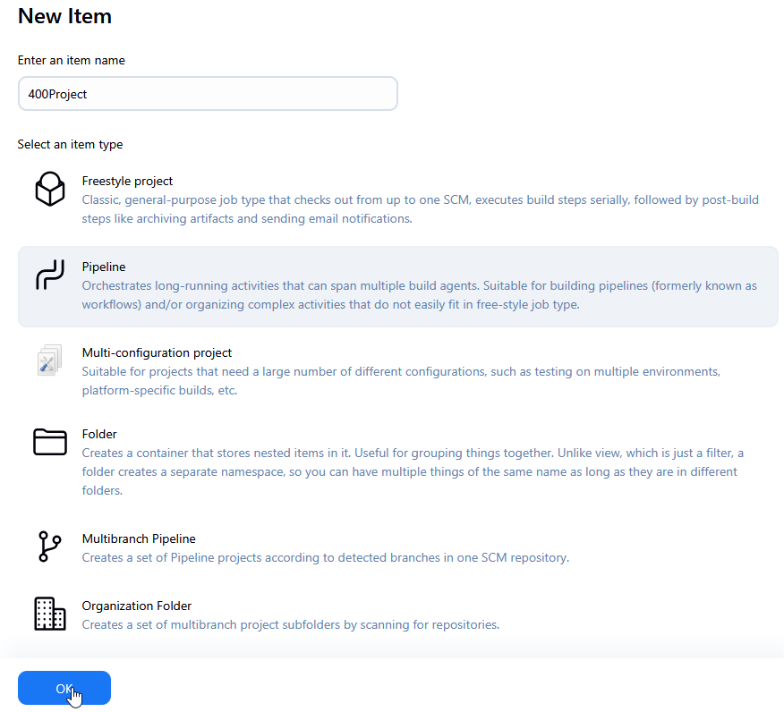</td>
  </tr>
</table>
</p>

15. Under "Triggers", enable `Github hook trigger for GITScm polling` option:

<p align='center'>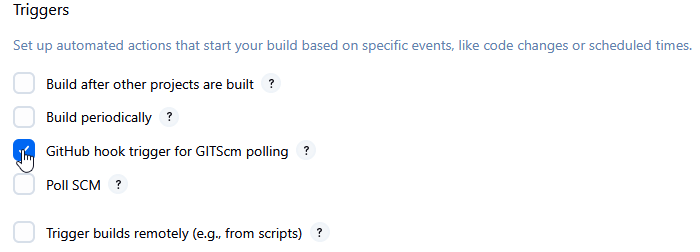</img></p>

16. Definition Section -> Switch `Pipeline script` to `Pipeline script from SCM` -> Change SCM from `None` to `Git` -> then put your forked repo's URL in the `Repository URL` field -> `Apply` -> `Save` :

<p align="center">
<table border="0">
  <tr>
    <td>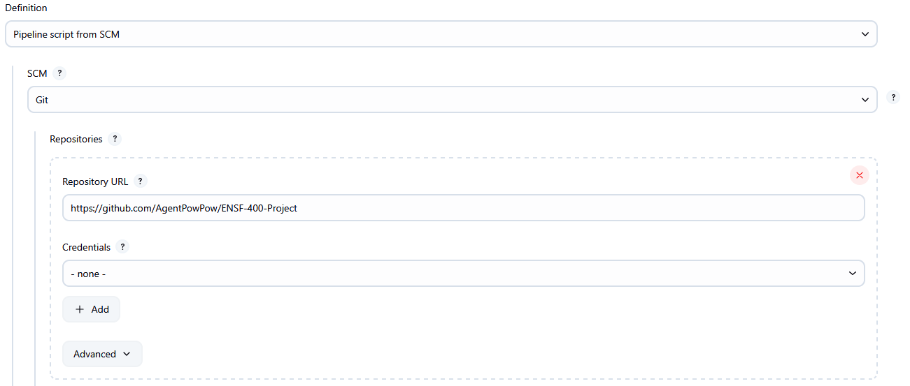</td>
    <td style="font-size: 40px; text-align: center;">→</td>
    <td></td>
  </tr>
</table>
</p>

17. Now Jenkins is set up.

## Connecting Docker to Jenkins

1. Log in to your Docker Hub

2. Top right, click your profile's icon -> `Account Settings`, this should redirect you to your app.docker.com/settings WebPage

<p align='center'>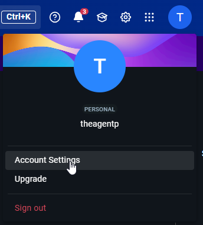</img></p>

3. `Personal Access Tokens` -> `Generate New Token` -> Access Token Description: `Jenkins` -> Access permissions: `Read & Write` -> `Generate`

<p align="center">
<table border="0">
  <tr>
    <td>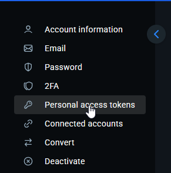</td>
    <td style="font-size: 40px; text-align: center;">→</td>
    <td>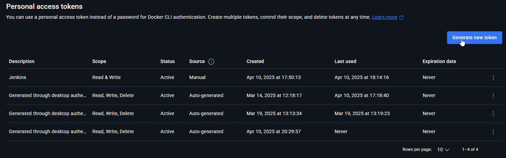</td>
    <td style="font-size: 40px; text-align: center;">→</td>
    <td>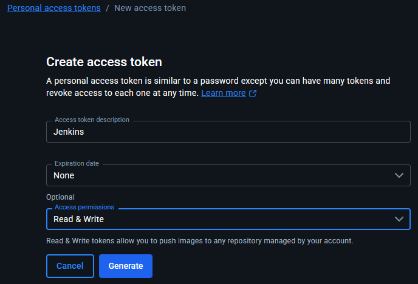</td>
  </tr>
</table>
</p>

4. Copy your token:
<p align='center'>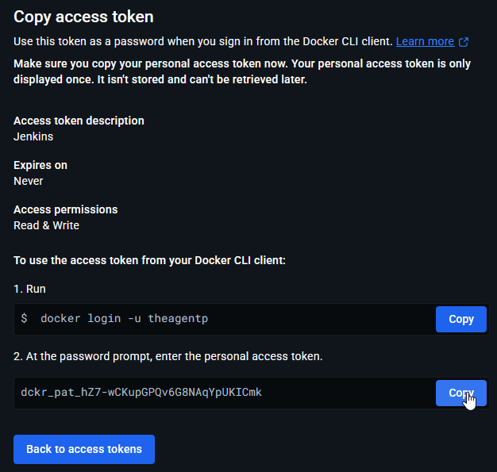</img></p>

5. Go back to your Jenkins GUI -> Dashboard -> Manage Jenkins -> Search `Credentials` -> click `(global)`

<p align="center">
<table border="0">
  <tr>
    <td>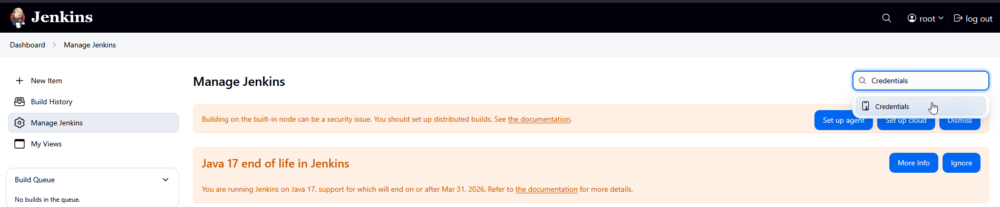</td>
    <td style="font-size: 40px; text-align: center;">→</td>
    <td>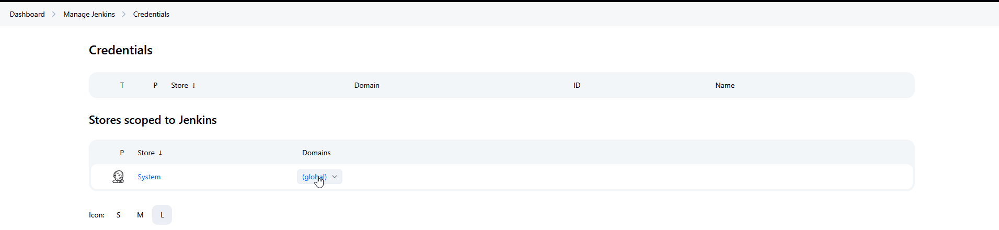</td>
  </tr>
</table>
</p>

6. `+ Add Credentials` -> `Username with password` -> Scope: `Global` -> Username: (insert your docker username here) -> `treat username as secret` -> Password: (paste your previously copied docker PAT) -> ID: docker-pat -> Description: docker-pat

<p align="center">
<table border="0">
  <tr>
    <td>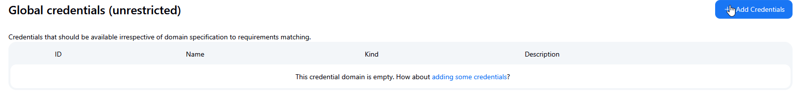</td>
    <td style="font-size: 40px; text-align: center;">→</td>
    <td>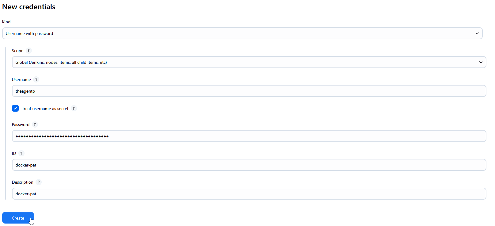</td>
  </tr>
</table>
</p>

7. Now, your Jenkins should be properly connected to your Docker account.

## Creating a GitHib Server on Jenkins using a Github Personal Access Token

1. Log in into Githib -> then navigate to `https://github.com/settings/tokens` -> `Generate new token` -> Select ` Generate new token (classic)

<p align='center'></img></p>

2. Name: Jenkins -> Select These Scopes: [repo, workflow, admin:org, admin:repo_hook, codespace]

<p align="center">
<table border="0">
  <tr>
    <td>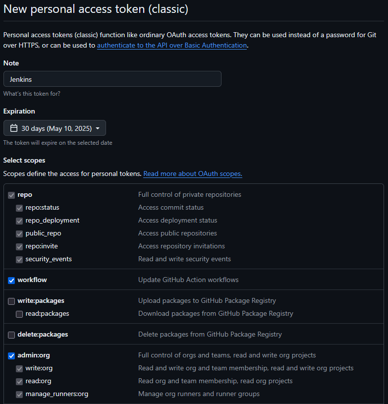</td>
    <td style="font-size: 40px; text-align: center;">+</td>
    <td>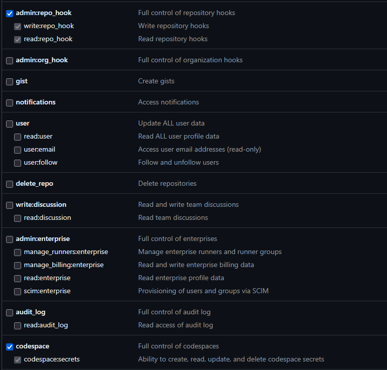</td>
  </tr>
</table>
</p>