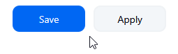

# Initial Setup
## Fork from the ENSF-400-PROJECT Master Branch
This is because we need to change the repository 's settings, which requires you to have "Admin" level privileges, which is only available to the owner of the repository . Unless the it is owned by an organization.

## Start Jenkins instance as seen in Lab 9
1. Enter the terminal with the command: Control + Shift + `
2. Go to the Jenkins Folder with the command  ```cd jenkins/```
3. Run this command:
```bash
$ docker compose up -d
```
4.  Go to the "Ports" section:
<p align='center'></img></p>
5.  Make the Jenkins Port visible (set as 8080)
<p align='center'></img></p>
<p align='center'></img></p>

Should look like this now:

<p align='center'></img></p>

6. Go back to your Terminal then run this command to find your key to unlock Jenkins:
```bash
$ docker compose logs jenkins
```

Then in the output you should find the key (highlighted, unique per user): 
<p align='center'></img></p>

7. Click the globe icon to visit your Jenkins GUI:
<p align='center'></img></p>

8. Paste the password into the administrator password field and then click Enter:
<p align='center'></img></p>

9. Click Install Suggested Plugins
<p align='center'></img></p>

10. "Create First Admin User" Page -> Fill in your desired credentials -> `Save and Continue` -> save your Jenkins URL (we need this later) -> `Save and Finish` -> `Start using Jenkins`
<p align="center">
  
  <span style="font-size: 30px; margin: 0 15px;">→</span>
  
  <span style="font-size: 30px; margin: 0 15px;">→</span>
  
</p>


11. Docker Pipeline Installation .. Dashboard -> Manage Jenkins -> Plugins -> Available Plugins -> Docker Pipeline    
<p align="center">
  
  <span style="font-size: 30px; margin: 0 15px;">→</span>
  
  <span style="font-size: 30px; margin: 0 15px;">→</span>
</p>

<p align='center'></img></p>

12. Restart Jenkins after installing the plugin. Go back to your terminal and run this command:
```bash
$ docker compose restart jenkins
```

13. Refresh Jenkins page and re-login with credentials (the username and password you registered with)

14. Dashboard -> `New Item` -> Choose Job name -> `Pipeline` -> `OK`

<p align="center">
  
  <span style="font-size: 30px; margin: 0 15px;">→</span>
  
</p>

15. Under "Triggers", enable `Github hook trigger for GITScm polling` option:

<p align='center'></img></p>

16. Definition Section -> Switch `Pipeline script` to `Pipeline script from SCM` -> Change SCM from `None` to `Git` -> then put your forked repo's URL in the `Repository URL` field -> `Apply` -> `Save` :

<p align="center">
  
  <span style="font-size: 30px; margin: 0 15px;">→</span>
  
</p>

17. Now Jenkins is set up.